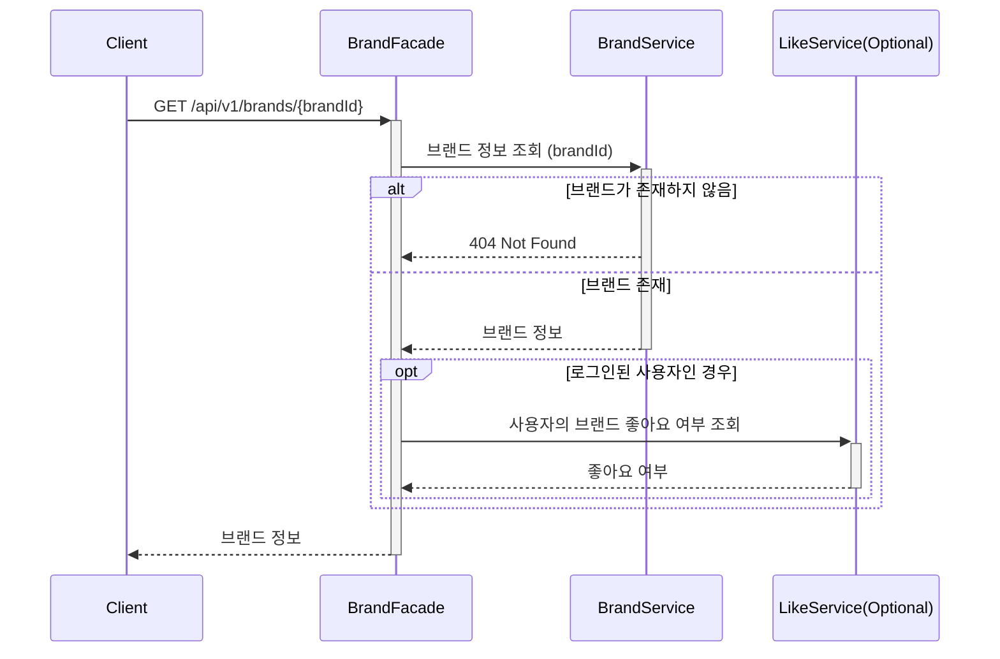
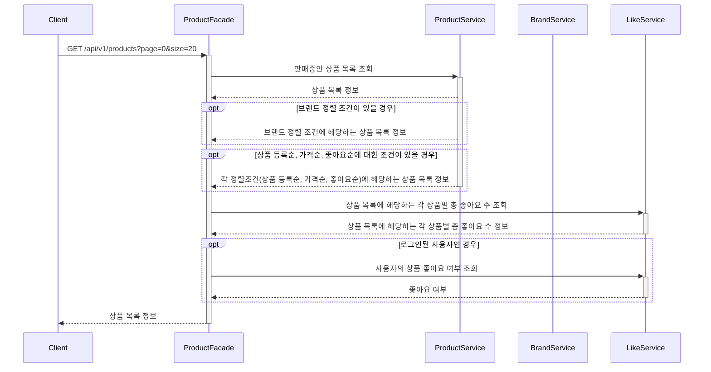
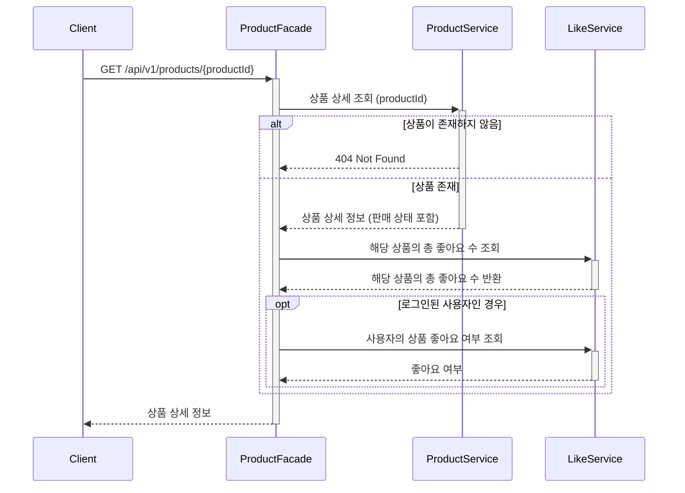
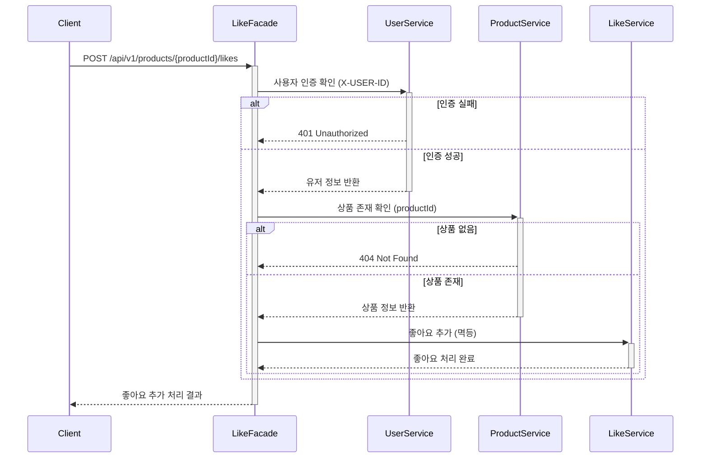
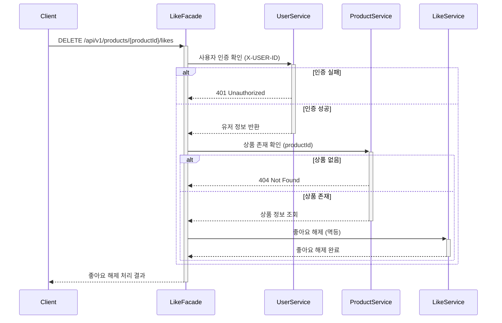
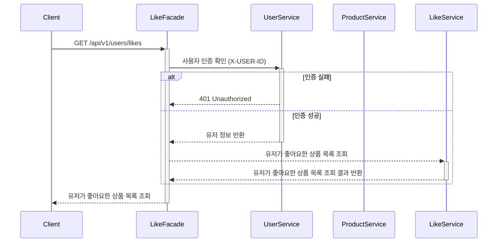
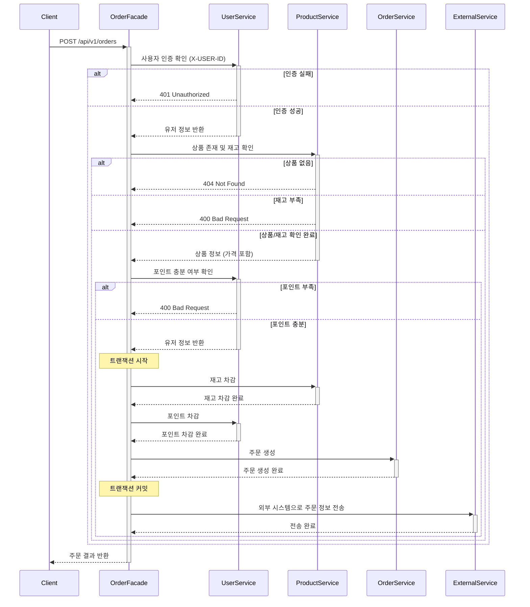
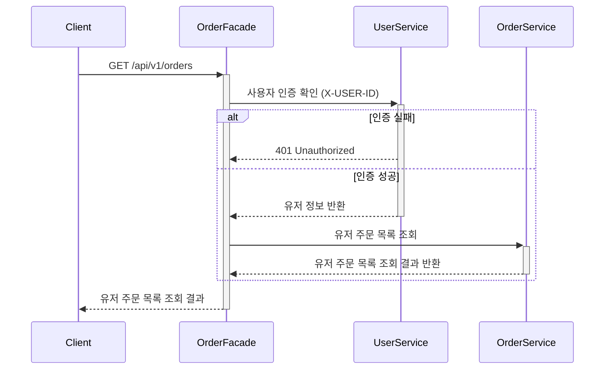
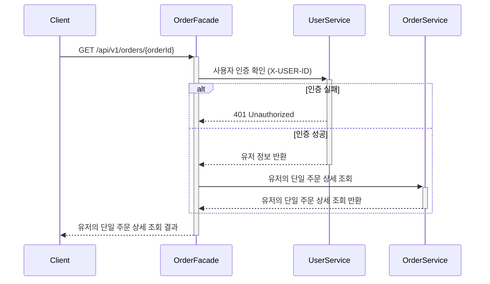

# 브랜드

## 브랜드 정보 조회

```mermaid
sequenceDiagram
    participant C as Client
    participant BF as BrandFacade
    participant BS as BrandService
    participant LS as LikeService(Optional)
    
    C ->>+ BF: GET /api/v1/brands/{brandId}
    BF ->>+ BS: 브랜드 정보 조회 (brandId)
    
    alt 브랜드가 존재하지 않음
        BS -->> BF: 404 Not Found
    else 브랜드 존재
        BS -->>- BF: 브랜드 정보
        opt 로그인된 사용자인 경우
            BF ->>+ LS: 사용자의 브랜드 좋아요 여부 조회
            LS -->>- BF: 좋아요 여부
        end
    end
    BF -->>- C: 브랜드 정보
```

---

# 상품

## 상품 목록 조회

```mermaid
sequenceDiagram
    participant C as Client
    participant PF as ProductFacade
    participant PS as ProductService
    participant BS as BrandService
    participant LS as LikeService
    
    C ->>+ PF: GET /api/v1/products?page=0&size=20
    PF ->>+ PS: 판매중인 상품 목록 조회
    PS -->> PF: 상품 목록 정보
    opt 브랜드 정렬 조건이 있을 경우
	    PS -->> PF: 브랜드 정렬 조건에 해당하는 상품 목록 정보
	end
	opt 상품 등록순, 가격순, 좋아요순에 대한 조건이 있을 경우
		PS -->>- PF: 각 정렬조건(상품 등록순, 가격순, 좋아요순)에 해당하는 상품 목록 정보
	end
	PF ->>+ LS: 상품 목록에 해당하는 각 상품별 총 좋아요 수 조회
	LS -->>- PF: 상품 목록에 해당하는 각 상품별 총 좋아요 수 정보
    opt 로그인된 사용자인 경우
        PF ->>+ LS: 사용자의 상품 좋아요 여부 조회
        LS -->>- PF: 좋아요 여부
    end
    PF -->>- C: 상품 목록 정보
```

## 상품 정보 조회

```mermaid
sequenceDiagram
    participant C as Client
    participant PF as ProductFacade
    participant PS as ProductService
    participant LS as LikeService
    
    C ->>+ PF: GET /api/v1/products/{productId}
    PF ->>+ PS: 상품 상세 조회 (productId)
    alt 상품이 존재하지 않음
        PS -->> PF: 404 Not Found
    else 상품 존재
        PS -->>- PF: 상품 상세 정보 (판매 상태 포함)
        PF ->>+ LS: 해당 상품의 총 좋아요 수 조회
        LS -->>- PF: 해당 상품의 총 좋아요 수 반환
        opt 로그인된 사용자인 경우
            PF ->>+ LS: 사용자의 상품 좋아요 여부 조회
            LS -->>- PF: 좋아요 여부
        end
    end
    PF -->>- C: 상품 상세 정보
```

---

# 좋아요

## 좋아요 추가

```mermaid
sequenceDiagram
    participant C as Client
    participant LF as LikeFacade
    participant US as UserService  
    participant PS as ProductService
    participant LS as LikeService
    
    C ->>+ LF: POST /api/v1/products/{productId}/likes
    LF ->>+ US: 사용자 인증 확인 (X-USER-ID)
    alt 인증 실패
        US -->> LF: 401 Unauthorized
    else 인증 성공
		US -->>- LF: 유저 정보 반환
        LF ->>+ PS: 상품 존재 확인 (productId)
        alt 상품 없음
            PS -->> LF: 404 Not Found
        else 상품 존재
	        PS -->>- LF: 상품 정보 반환
            LF ->>+ LS: 좋아요 추가 (멱등)
            LS -->>- LF: 좋아요 처리 완료
        end
    end
    LF -->>- C: 좋아요 추가 처리 결과
```

## 좋아요 해제

```mermaid
sequenceDiagram
    participant C as Client
    participant LF as LikeFacade
    participant US as UserService
    participant PS as ProductService
    participant LS as LikeService
    
    C ->>+ LF: DELETE /api/v1/products/{productId}/likes
    LF ->>+ US: 사용자 인증 확인 (X-USER-ID)
    alt 인증 실패
        US -->> LF: 401 Unauthorized
    else 인증 성공
	    US -->>- LF: 유저 정보 반환
        LF ->>+ PS: 상품 존재 확인 (productId)
        alt 상품 없음
            PS -->> LF: 404 Not Found
        else 상품 존재
	        PS -->>- LF: 상품 정보 조회
            LF ->>+ LS: 좋아요 해제 (멱등)
            LS -->>- LF: 좋아요 해제 완료
        end
    end
    LF -->>- C: 좋아요 해제 처리 결과
```

## 내가 좋아요 한 상품 목록 조회

```mermaid
sequenceDiagram
    participant C as Client
    participant LF as LikeFacade
    participant US as UserService
    participant PS as ProductService
    participant LS as LikeService
    
    C ->>+ LF: GET /api/v1/users/likes
    LF ->>+ US: 사용자 인증 확인 (X-USER-ID)
    alt 인증 실패
        US -->> LF: 401 Unauthorized
    else 인증 성공
        US -->>- LF: 유저 정보 반환
        LF -->>+ LS: 유저가 좋아요한 상품 목록 조회
        LS -->>- LF: 유저가 좋아요한 상품 목록 조회 결과 반환
    end
    LF -->>- C: 유저가 좋아요한 상품 목록 조회
```

---

# 주문 & 결제

## 주문 요청

```mermaid
sequenceDiagram
    participant C as Client
    participant OF as OrderFacade
    participant US as UserService
    participant PS as ProductService
    participant OS as OrderService
    participant ES as ExternalService
    
    C ->>+ OF: POST /api/v1/orders
    
    OF ->>+ US: 사용자 인증 확인 (X-USER-ID)
    
    alt 인증 실패
        US -->> OF: 401 Unauthorized
    else 인증 성공
	    US -->>- OF: 유저 정보 반환
        OF ->>+ PS: 상품 존재 및 재고 확인
        alt 상품 없음
            PS -->> OF: 404 Not Found
        else 재고 부족
            PS -->> OF: 400 Bad Request
        else 상품/재고 확인 완료
            PS -->>- OF: 상품 정보 (가격 포함)
            
            OF ->>+ US: 포인트 충분 여부 확인
            alt 포인트 부족
                US -->> OF: 400 Bad Request
            else 포인트 충분
	            US -->>- OF: 유저 정보 반환
                Note over OF: 트랜잭션 시작
                OF ->>+ PS: 재고 차감
                PS -->>- OF: 재고 차감 완료
                
                OF ->>+ US: 포인트 차감
                US -->>- OF: 포인트 차감 완료
                
                OF ->>+ OS: 주문 생성
                OS -->>- OF: 주문 생성 완료
                Note over OF: 트랜잭션 커밋
                
                OF ->>+ ES: 외부 시스템으로 주문 정보 전송
                ES -->>- OF: 전송 완료
            end
        end
    end
    OF -->>- C: 주문 결과 반환
```

## 유저의 주문 목록 조회

```mermaid
sequenceDiagram
    participant C as Client
    participant OF as OrderFacade
    participant US as UserService
    participant OS as OrderService

	C ->>+ OF: GET /api/v1/orders
	OF ->>+ US: 사용자 인증 확인 (X-USER-ID)
	alt 인증 실패
        US -->> OF: 401 Unauthorized
    else 인증 성공
	    US -->>- OF: 유저 정보 반환
	    OF ->>+ OS: 유저 주문 목록 조회
	    OS -->>- OF: 유저 주문 목록 조회 결과 반환
	end
	OF -->>- C: 유저 주문 목록 조회 결과
```

## 단일 주문 상세 조회

```mermaid
sequenceDiagram
    participant C as Client
    participant OF as OrderFacade
    participant US as UserService
    participant OS as OrderService

	C ->>+ OF: GET /api/v1/orders/{orderId}
	OF ->>+ US: 사용자 인증 확인 (X-USER-ID)
	alt 인증 실패
        US -->> OF: 401 Unauthorized
    else 인증 성공
	    US -->>- OF: 유저 정보 반환
	    OF ->>+ OS: 유저의 단일 주문 상세 조회
	    OS -->>- OF: 유저의 단일 주문 상세 조회 반환
	end
	OF -->>- C: 유저의 단일 주문 상세 조회 결과
```