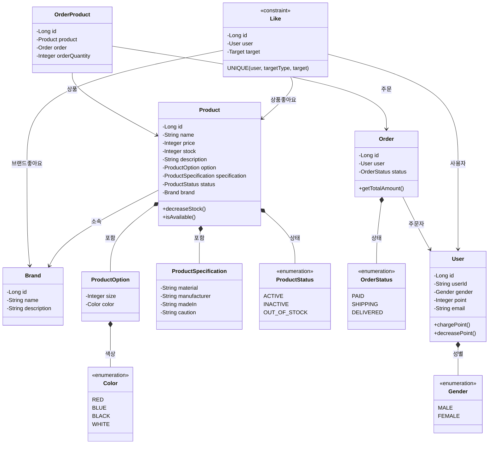

# 클래스 다이어그램

```mermaid
classDiagram
    class Brand {
        -Long id
        -String name
        -String description
    }
    
    class Product {
        -Long id
        -String name
        -Integer price
        -Integer stock
        -String description
        -ProductOption option
        -ProductSpecification specification
        -ProductStatus status
        -Brand brand
        +decreaseStock()
        +isAvailable()
    }
    
    class ProductOption {
        -Integer size
        -Color color 
    }
    
    class ProductSpecification {
        -String material
        -String manufacturer
        -String madeIn
        -String caution
    }
    
    class ProductStatus {
        <<enumeration>>
        ACTIVE
        INACTIVE
        OUT_OF_STOCK
    }
    
    class Color {
        <<enumeration>>
        RED
        BLUE
        BLACK
        WHITE
    }
    
    class Like {
        -Long id 
        -User user
        -Target target
        <<constraint>>
        UNIQUE(user, targetType, target)
    }
    
    class Order {
        -Long id
        -User user
        -OrderStatus status
        +getTotalAmount()
    }
    
    class OrderStatus {
        <<enumeration>>
        PAID
        SHIPPING
        DELIVERED
    }
    
    class OrderProduct {
        -Long id
        -Product product
        -Order order
        -Integer orderQuantity
    }
    
    class User {
        -Long id
        -String userId
        -Gender gender
        -Integer point
        -String email
        +chargePoint()
        +decreasePoint()
    }
    
    class Gender {
        <<enumeration>>
        MALE
        FEMALE
    }

    %% 컴포지션 관계 (VO)
    Product *-- ProductOption: 포함
    Product *-- ProductSpecification: 포함
    Product *-- ProductStatus: 상태
    ProductOption *-- Color: 색상
    User *-- Gender: 성별
    Order *-- OrderStatus: 상태

    %% 연관관계 (도메인 객체 참조)
    Product --> Brand: 소속
    Like --> User: 사용자
    Like --> Product: 상품좋아요
    Like --> Brand: 브랜드좋아요
    Order --> User: 주문자
    OrderProduct --> Order: 주문
    OrderProduct --> Product: 상품
```