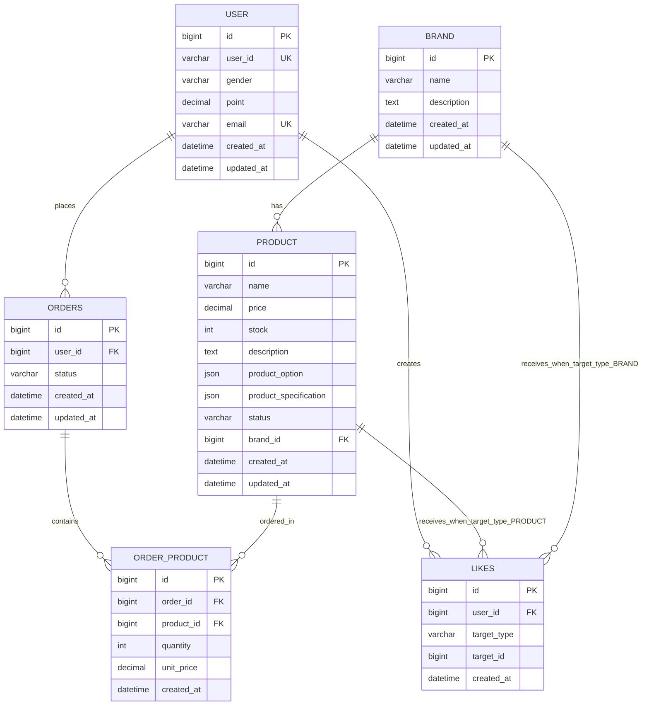

# ERD

```mermaid
erDiagram
    BRAND {
        bigint id PK
        varchar name
        text description
        datetime created_at
        datetime updated_at
    }

    PRODUCT {
        bigint id PK
        varchar name
        decimal price
        int stock
        text description
        json product_option
        json product_specification
        varchar status
        bigint brand_id FK
        datetime created_at
        datetime updated_at
    }

    USER {
        bigint id PK
        varchar user_id UK
        varchar gender
        decimal point
        varchar email UK
        datetime created_at
        datetime updated_at
    }

    LIKES {
        bigint id PK
        bigint user_id FK
        varchar target_type
        bigint target_id
        datetime created_at
    }

    ORDERS {
        bigint id PK
        bigint user_id FK
        varchar status
        datetime created_at
        datetime updated_at
    }

    ORDER_PRODUCT {
        bigint id PK
        bigint order_id FK
        bigint product_id FK
        int quantity
        decimal unit_price
        datetime created_at
    }

    %% 관계 정의
    BRAND ||--o{ PRODUCT : "has"
    USER ||--o{ LIKES : "creates"
    USER ||--o{ ORDERS : "places"
    ORDERS ||--o{ ORDER_PRODUCT : "contains"
    PRODUCT ||--o{ ORDER_PRODUCT : "ordered_in"
    PRODUCT ||--o{ LIKES : "receives_when_target_type_PRODUCT"
    BRAND ||--o{ LIKES : "receives_when_target_type_BRAND"
```